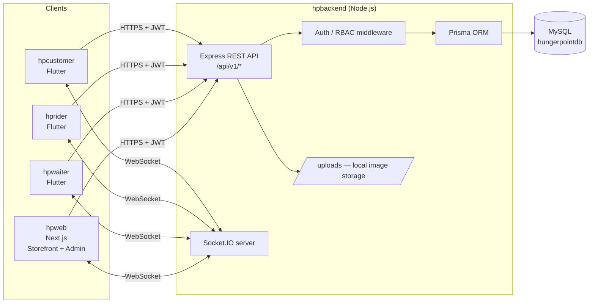
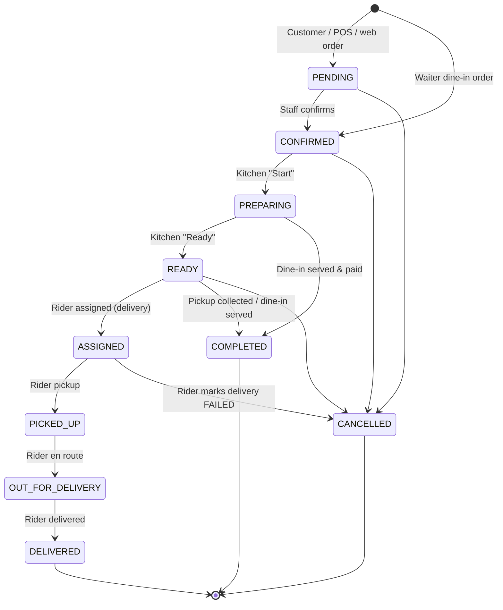
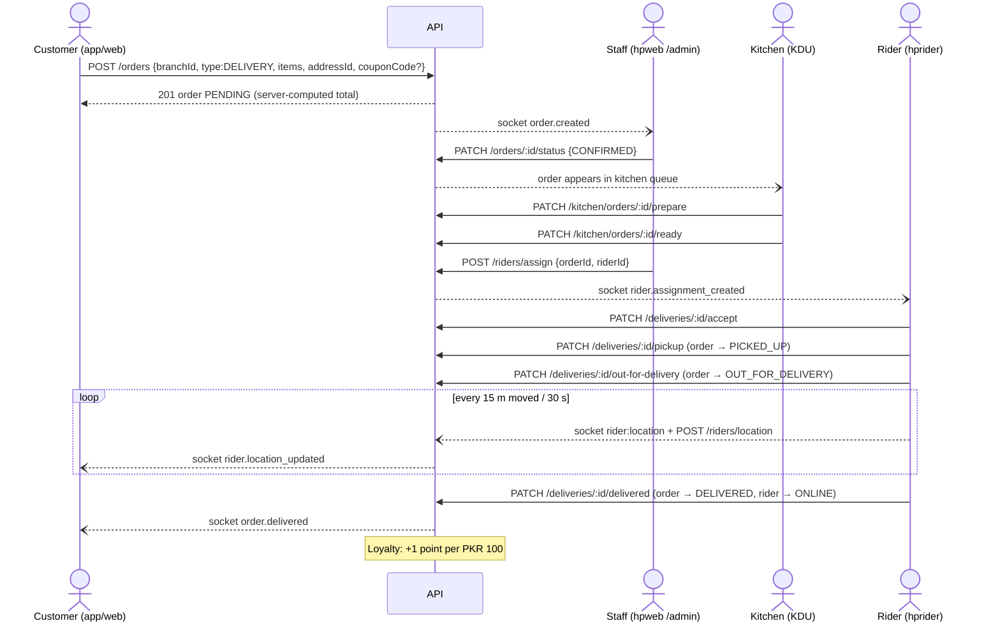

# HungerPoint — Project Documentation

> Multi-branch food ordering, delivery, dine-in and restaurant-operations platform for HungerPoint (Islamabad, PKR).
> Last updated: **2026-09-27**.

This document covers architecture, roles, business flows, the API, the database, each app, setup, configuration and deployment. It closes with the results of the latest end-to-end flow audit and the list of known issues.

Related documents:

- [`HUNGERPOINT_REQUIRMENTS.md`](HUNGERPOINT_REQUIRMENTS.md): the original product requirements / master specification.
- [`docs/bugs/bugs.md`](docs/bugs/bugs.md): bug-tracking index with detailed bug reports.

---

## Table of Contents

1. [System Overview](#1-system-overview)
2. [Architecture](#2-architecture)
3. [Repository Layout](#3-repository-layout)
4. [Technology Stack](#4-technology-stack)
5. [Roles & Access Control](#5-roles--access-control)
6. [Core Business Flows](#6-core-business-flows)
7. [Real-Time Events (Socket.IO)](#7-real-time-events-socketio)
8. [Backend API Reference](#8-backend-api-reference)
9. [Database](#9-database)
10. [Web App — `hpweb`](#10-web-app--hpweb)
11. [Mobile Apps](#11-mobile-apps)
12. [Local Development Setup](#12-local-development-setup)
13. [Configuration Reference](#13-configuration-reference)
14. [Deployment](#14-deployment)
15. [Security Model](#15-security-model)
16. [Flow Audit — 2026-09-27](#16-flow-audit--2026-09-27)
17. [Known Issues & Recommended Next Steps](#17-known-issues--recommended-next-steps)
18. [Troubleshooting](#18-troubleshooting)

---

## 1. System Overview

HungerPoint is one backend serving four clients:

| App | Folder | Platform | Who uses it | Purpose |
|---|---|---|---|---|
| **Backend API** | `hpbackend/` | Node.js (Express 5 + Prisma + MySQL + Socket.IO) | — | REST API, business rules, real-time events |
| **Web App** | `hpweb/` | Next.js 16 (React 19) | Customers (storefront) and all restaurant staff (admin console) | Online ordering, admin, POS, kitchen display, reports, settings |
| **Customer App** | `hpcustomer/` | Flutter (Android / iOS) | Customers | Browse menu, order (delivery / pickup), vouchers, live tracking, loyalty |
| **Rider App** | `hprider/` | Flutter | Delivery riders | Receive assignments, run the delivery lifecycle, stream GPS location |
| **Waiter App** | `hpwaiter/` | Flutter | Waiters | Floor/table view, dine-in ordering, reservations |

**Main capabilities:**

- Multi-branch operation (branches, hours, delivery zones, per-branch staff).
- Menu management: categories, products, variants, flavours, add-ons.
- Three order types: **Delivery**, **Pickup** and **Dine-In**. Orders come from five sources: mobile app, website, POS, phone and waiter app.
- Kitchen Display Unit (KDU), rider dispatch, and live order and rider tracking.
- Coupons / vouchers, a loyalty points program, reviews moderation, inventory and reports.
- Role-based access with 8 roles.

---

## 2. Architecture



**Key design points:**

- **Single source of truth.** Every price, status change and permission decision is made by the backend. Clients only display estimates, and the server's `total` is what gets charged.
- **Stateless JWT auth** with an access token and a rotating refresh token. Refresh tokens are stored hashed (SHA-256) in the `refresh_tokens` table.
- **REST for actions, Socket.IO for push.** Every status change is written through the API, then broadcast to the relevant rooms (kitchen, admins, the order's trackers, the assigned rider).
- **Configurable API host in the mobile apps** through `--dart-define` build flags, so the same code runs against a local dev machine or production.

---

## 3. Repository Layout

```
HungerPoint/
├── package.json                 # Root delegator: build/start → hpbackend (for hosts that need package.json at repo root)
├── HUNGERPOINT_REQUIRMENTS.md   # Product requirements / master spec
├── PROJECT_DOCUMENTATION.md     # ← this file
├── docs/bugs/                   # Bug index + per-bug reports
│
├── hpbackend/
│   ├── prisma/schema.prisma     # Database schema (MySQL)
│   ├── src/
│   │   ├── index.ts             # HTTP + Socket.IO bootstrap
│   │   ├── app.ts               # Express app: security, CORS, rate limit, routes, upload
│   │   ├── config/database.ts   # Prisma client (+ DB_* → DATABASE_URL composition)
│   │   ├── middleware/          # auth (authenticate / authorize / optionalAuth), error, notFound
│   │   ├── sockets/index.ts     # Socket.IO rooms, events, emit helpers
│   │   ├── prisma/seed.ts       # Demo data seed
│   │   └── modules/<feature>/   # *.routes.ts → *.controller.ts → *.service.ts
│   └── uploads/                 # Uploaded images (served at /uploads)
│
├── hpweb/
│   ├── app/                     # Next.js App Router pages (see §10)
│   ├── components/              # Navbar, CartDrawer, ProductModal, AuthModal, HeroBanner
│   ├── context/                 # AuthContext, CartContext, BranchContext
│   └── lib/                     # api.ts (fetch wrapper + token refresh), socket.ts
│
├── hpcustomer/lib/              # screens/, services/ (api, socket, cart, address…), widgets/, constants/
├── hprider/lib/                 # screens/, services/ (api, socket, location_tracking)…
└── hpwaiter/lib/                # screens/, services/ (api, socket, table_cart)…
```

**Backend module pattern:** every feature lives in `src/modules/<name>/` as `routes → controller → service`.

- **Routes** declare authentication and role guards.
- **Controllers** read the request and apply request-level rules, such as ownership or branch scoping.
- **Services** hold business logic and all database access.

---

## 4. Technology Stack

| Layer | Technology |
|---|---|
| Backend runtime | Node.js 22, TypeScript 5.9 |
| Web framework | Express 5, `helmet`, `cors`, `express-rate-limit`, `express-validator`, `morgan`, `multer` |
| ORM / DB | Prisma 6.4 with MySQL 8 (local: WAMP/XAMPP) |
| Auth | `jsonwebtoken` (access + refresh), `bcryptjs` (12 rounds) |
| Real-time | Socket.IO 4.8 (server + `socket.io-client` / `socket_io_client`) |
| Web | Next.js 16.3, React 19.2, Tailwind CSS 4, `lucide-react`, `geist` fonts (self-hosted) |
| Mobile | Flutter (Dart SDK ^3.10): `http`, `shared_preferences`, `socket_io_client`, `geolocator`, `flutter_map` (customer), `url_launcher`, `image_picker` |

---

## 5. Roles & Access Control

### 5.1 The 8 roles

| Role | Signs in on | How | Scope | Summary |
|---|---|---|---|---|
| `SUPER_ADMIN` | hpweb `/admin` | Phone/email + password | All branches | Platform owner. Everything an Admin can do, plus: delete branches, edit System Settings, create/manage Admin & Super Admin accounts |
| `ADMIN` | hpweb `/admin` | Phone/email + password | All branches | Day-to-day operations: menu, orders, POS, riders, inventory, KDU, reports, promotions, staff (below Admin tier). Settings are **view-only** |
| `BRANCH_MANAGER` | hpweb `/admin` | Password | Own branch | Runs one branch: menu edits, orders, kitchen, riders, inventory, reports, tables |
| `BRANCH_STAFF` | hpweb `/admin` | Password | Own branch | Front-of-house: POS, orders, reservations, branch dashboard |
| `KITCHEN_STAFF` | hpweb → redirected to `/admin/kitchen` | Password | Own branch | Kitchen Display Unit: start preparing / mark ready |
| `RIDER` | hprider app | Password | Assigned deliveries | Delivery lifecycle + live GPS |
| `WAITER` | hpwaiter app | Password | Own branch | Tables, dine-in orders, reservations |
| `CUSTOMER` | hpcustomer app or hpweb storefront | Email + password | Own data only | Orders, addresses, favorites, vouchers, loyalty, reviews |

> **Every app signs in with email + password.** Accounts created by an admin (riders, waiters, branch staff…) must be given an email, otherwise they cannot sign in to the mobile apps. The web admin console also accepts the phone number.

### 5.2 Super Admin vs Admin

| Capability | SUPER_ADMIN | ADMIN |
|---|:-:|:-:|
| Menu, orders, POS, riders, inventory, KDU, reports, promotions, reviews, loyalty | ✅ | ✅ |
| Create branches / edit branches | ✅ | ✅ |
| **Delete branches** | ✅ | ❌ |
| View System Settings | ✅ | ✅ |
| **Edit System Settings** (tax %, delivery fee, business info) | ✅ | ❌ (view-only) |
| Create/edit Branch Manager, Branch Staff, Kitchen Staff accounts | ✅ | ✅ |
| **Create/edit/promote Admin or Super Admin accounts** | ✅ | ❌ (HTTP 403) |

### 5.3 Permission matrix (backend-enforced)

| Area | SA | AD | BM | BS | KS | RD | WT | CU |
|---|:-:|:-:|:-:|:-:|:-:|:-:|:-:|:-:|
| Browse menu / branches / coupons (public) | ✅ | ✅ | ✅ | ✅ | ✅ | ✅ | ✅ | ✅ |
| Place order | ✅ | ✅ | ✅ | ✅ | — | — | ✅ | ✅ (own) |
| View order | all | all | branch | branch | branch | assigned | branch | own |
| Change order status (`PATCH /orders/:id/status`) | ✅ | ✅ | branch | branch | branch | ❌ | branch | ❌ |
| Kitchen queue & actions | ✅ | ✅ | branch | — | branch | — | — | — |
| Assign rider | ✅ | ✅ | ✅ | — | — | — | — | — |
| Delivery lifecycle (`/deliveries`) | — | — | — | — | — | own | — | — |
| Tables & reservations | ✅ | ✅ | ✅ | ✅ | — | — | ✅ | — |
| Menu create/update | ✅ | ✅ | ✅ | — | — | — | — | — |
| Menu delete | ✅ | ✅ | — | — | — | — | — | — |
| Inventory, reports, riders mgmt, coupons, reviews, loyalty admin | ✅ | ✅ | ✅ | — | — | — | — | — |
| Staff accounts (`/users`) | ✅ | ✅ (below Admin tier) | — | — | — | — | — | — |
| System Settings | edit | view | — | — | — | — | — | — |
| Delete branch | ✅ | — | — | — | — | — | — | — |

*SA = Super Admin, AD = Admin, BM = Branch Manager, BS = Branch Staff, KS = Kitchen Staff, RD = Rider, WT = Waiter, CU = Customer. "branch" = only orders/data of the user's own branch.*

### 5.4 Seeded demo accounts (`npm run prisma:seed`)

| Role | Phone | Password | Name | Branch |
|---|---|---|---|---|
| SUPER_ADMIN | `+923000000001` | `Admin@123456` | Super Administrator | — |
| BRANCH_MANAGER | `+923000000002` | `Admin@123456` | Manager G11 | G-11 |
| KITCHEN_STAFF | `+923000000003` | `Admin@123456` | Chef Tariq | G-11 |
| RIDER | `+923000000004` | `Admin@123456` | Rider Kamran | G-11 |
| BRANCH_STAFF | `+923000000005` | `Admin@123456` | Staff Ali | G-11 |
| WAITER | `+923000000006` | `Admin@123456` | Waiter Bilal | G-11 |
| ADMIN | `+923000000007` | `Admin@123456` | Admin Sana | — |
| CUSTOMER | `+923009999999` | `Customer@123456` | Ahmed Khan | — |

Phone numbers must be entered exactly in `+92…` format.

> ⚠️ These are **development** credentials. Change every password (or don't run the seed) on a real deployment.

---

## 6. Core Business Flows

### 6.1 Authentication

**All apps (customer, rider, waiter) and the web: email + password**

```
POST /auth/login    { email, password }                  → { user, accessToken, refreshToken }
POST /auth/register { name, email, phone, password }     → customer account + tokens
```

- **Email** is trimmed and matched case-insensitively. The web admin console also accepts a phone number at `/auth/login`, in any common Pakistani format (`+923001234567`, `03001234567`, `0300 1234567`).
- **Customer self sign-up** needs a name, an email, a mobile number and a password of at least 8 characters. The mobile number is a contact number for riders and is not verified. Email and mobile number must each be unused.
- **Accounts created by an admin** (Riders page, Settings → Staff) require an email, a phone number and a temporary password. The Rider and Waiter apps accept only their own role.
- **Throttling:** 20 failed sign-ins per visitor IP per 15 minutes (successful ones do not count) and 30 sign-up attempts per IP per hour in production.
- There is **no SMS / OTP step**. The old `send-otp`, `verify-otp` and `complete-profile` endpoints were removed on 2026-10-02, so Twilio is no longer needed.

**Tokens:**

- The access token carries `{ userId, role, branchId }`.
- `authenticate` re-reads the user on every request, so deactivating an account takes effect immediately.
- `POST /auth/refresh` rotates the refresh token.
- `hpweb` and `hprider` refresh automatically on a 401.
- Default lifetime is 30 days for both tokens (see §17 for a known issue).

### 6.2 Order status model



**Final states:** `DELIVERED`, `COMPLETED`, `CANCELLED`, `REJECTED` and `REFUNDED` are locked. Any further status change returns HTTP 400, which also prevents double-awarding loyalty points.

**Guardrails enforced by the backend:**

| Rule | Where |
|---|---|
| Kitchen "Start" only from `CONFIRMED`/`ACCEPTED`; "Ready" only from `PREPARING` | `kitchen.service.ts` |
| Kitchen staff / branch managers only see and act on their own branch's tickets | `kitchen.controller.ts` |
| Rider assignment only for **DELIVERY** orders that are **READY** (or re-assignment before pickup), to an **active** rider. The previous rider is freed on re-assignment | `rider.service.ts` |
| Once a rider owns a delivery, the manual status endpoint is blocked: status advances only through the rider's delivery actions, keeping `Order` and `Delivery` in sync | `order.controller.ts` |
| Riders cannot use `PATCH /orders/:id/status` at all | `order.routes.ts` |
| Invalid status values → 400; unknown order → 404 | `order.controller.ts` |
| Branch-scoped staff can only view/update their branch's orders | `order.controller.ts` |
| Every change is written to `order_status_history` with who changed it (`changedBy`) and emitted over Socket.IO | `order.service.ts` |

### 6.3 Delivery order — end to end



If the rider marks the delivery **failed**, the order becomes `CANCELLED` and the rider goes back to `ONLINE`.

### 6.4 Pickup order

Same as delivery up to `READY`, but there is no delivery fee and no rider. Staff mark it `COMPLETED` when the customer collects it. Assigning a rider to a pickup order is rejected.

### 6.5 Dine-in (waiter app)

1. The waiter opens the floor view (`GET /tables`, `/tables/floors`) and picks a table.
2. The waiter builds the order: menu, then item detail, then cart review, then `POST /orders { type: DINE_IN, tableId, source: WAITER_APP }`.
   - The order is created **`CONFIRMED`**, because the waiter has already vetted it. It goes straight to the kitchen queue, and the table becomes `OCCUPIED`.
   - The waiter is taken from the JWT and cannot be spoofed.
3. The kitchen prepares the order and marks it ready.
4. When the guests are served and have paid, the waiter marks the order `COMPLETED`. The table returns to `AVAILABLE`, and loyalty points are awarded if a customer is linked.

**Reservations** (`/reservations`): create (sets the table to `RESERVED`), **seat** or **cancel**. Statuses are `UPCOMING`, `SEATED`, `CANCELLED` and `NO_SHOW`.

### 6.6 POS (hpweb `/pos`)

Branch staff take walk-in or phone orders. Customers can be looked up by phone (`GET /customers/search`), or the order can be left as a walk-in with no customer. Source is `POS`, and the flow continues like a normal order.

### 6.7 Pricing

All totals are computed by the backend in `OrderService.createOrder`:

```
subtotal     = Σ (product.basePrice + variant.price + add-ons) × quantity
discount     = coupon discount on subtotal (0 if no coupon)
deliveryFee  = System Setting `default_delivery_fee` (DELIVERY only; 0 for PICKUP / DINE_IN)
tax          = subtotal × System Setting `default_tax_percent` / 100
total        = subtotal − discount + deliveryFee + tax
```

- Defaults are **5% tax** and a **PKR 50** delivery fee. A Super Admin can change both in **Settings → System** without redeploying.
- A size's **price is an offset** ("PKR +" in the admin form) added to the product's base price: a 500 product with a Large size of +300 costs 800. All apps show it that way.
- **Order lines carry the real choices.** Each line sends `productId`, `variantId` (size), `addonIds`, `quantity` and `notes` (flavour and the customer's note). A chosen drink is its own line, priced from the beverage product. The apps never send prices; the server prices everything.
- The server rejects: an unknown, inactive or foreign `variantId`; an unknown or inactive add-on; a quantity that is not a whole number from 1 to 50; and an empty order (400).
- The customer app only offers flavours, drinks and add-ons that the admin has actually created. Nothing is made up as a fallback, because anything shown must be orderable.
- An order needs a branch. If none exists (a new installation), the customer app says so instead of waiting.
- Inactive or unknown products are rejected (400 / 404).
- **Coupons** (`couponCode` on order creation) check:
  - active, start and expiry dates, and the global usage limit;
  - the minimum order amount;
  - the per-customer limit (counting non-cancelled orders).

  Discounts are either a **percentage** (capped by `maxDiscount`) or a **fixed amount**, never more than the subtotal. An invalid coupon fails the order with a clear 400 message instead of silently charging full price. `POST /coupons/validate { code, amount }` gives the same answer as a preview.
- **Loyalty:** on `DELIVERED` or `COMPLETED`, the customer earns `floor(total / 100)` points. Staff can adjust points through `/loyalty/adjust`.

### 6.8 Notifications

`GET /notifications` returns broadcast notifications to everyone, plus a signed-in user's own notifications. Users can mark their own notifications read individually or all at once (`PATCH /notifications/read-all`).

---

## 7. Real-Time Events (Socket.IO)

Clients connect to the API origin (the base URL without `/api/v1`) with `auth: { token }`.

**Rooms joined automatically on connect (authenticated sockets):**

| Room | Who |
|---|---|
| `user:{userId}` | Every signed-in user |
| `branch:{branchId}`, `kitchen:{branchId}` | Users with a branch |
| `role:{ROLE}` | Every signed-in user, by role |
| `order:{orderId}` | Any socket that emits `order:track { orderId }` |

**Client → server:**

| Event | Sent by | Payload |
|---|---|---|
| `order:track` | Customer app / web tracking page | `{ orderId }` |
| `rider:location` | Rider app | `{ latitude, longitude, orderId? }` |

**Server → client:**

| Event | Sent to | When |
|---|---|---|
| `order.created` | kitchen room of branch, admins | New order |
| `kitchen.queue_updated` | kitchen room | Queue changed |
| `order.<status>` (e.g. `order.confirmed`, `order.preparing`, `order.ready`, `order.assigned`, `order.picked_up`, `order.out_for_delivery`, `order.delivered`, `order.completed`, `order.cancelled`) | order room, admins | Any status change |
| `rider.assignment_created` | the assigned rider (`user:` room) | Rider assigned |
| `rider.location_updated` | order room, `role:ADMIN`, `role:SUPER_ADMIN` | Rider GPS update |
| `inventory.low_stock` | — | Defined but not emitted yet |

---

## 8. Backend API Reference

Base URL: `http://<host>:5000/api/v1`.

**Conventions:**

- Authentication uses the header `Authorization: Bearer <accessToken>`.
- Success responses look like `{ success: true, message?, data }`. List endpoints may also include `count` or pagination fields.
- Error responses look like `{ success: false, message }`.

**Status codes:**

| Code | Meaning |
|---|---|
| 400 | Validation or business rule |
| 401 | Not signed in / bad token |
| 403 | Role not allowed |
| 404 | Not found, or not visible to you |
| 409 | Duplicate |
| 429 | Rate limited |
| 500 | Unexpected error |

**Pagination:**

- `GET /orders?page=&limit=` returns `{ total, page, limit, totalPages, orders }`.
- `GET /reports/orders?page=&pageSize=` returns `data: { items, total, page, pageSize, totalPages }`. `pageSize` is capped at 100.

**Other endpoints:**

- **Health:** `GET /health` (outside `/api/v1`).
- **Uploads:** `POST /api/v1/upload`
  - Requires authentication.
  - Multipart field `image`; JPG, PNG, WEBP or GIF only; 10 MB maximum.
  - Returns `{ url, filename, size }`. Files are served from `/uploads/<file>`.

Access legend: **Public** means no token needed, **Auth** means any signed-in user, and role names mean only those roles.

### Auth — `/auth`
| Method | Path | Access | Notes |
|---|---|---|---|
| POST | `/register` | Public | `{ name, email, phone, password }` (password ≥ 8 characters) |
| POST | `/login` | Public | `{ email, password }` (the web admin console also accepts `phone`) |
| POST | `/refresh` | Public | `{ refreshToken }` → new pair (rotation) |
| POST | `/logout` | Public | `{ refreshToken }` revoked |
| GET | `/me` | Auth | Current profile |
| PUT | `/change-password` | Auth | Revokes all refresh tokens |

### Users (staff accounts) — `/users`
| Method | Path | Access | Notes |
|---|---|---|---|
| GET | `/` | SA, AD | Staff list |
| POST | `/` | SA, AD | Only SA may create ADMIN / SUPER_ADMIN |
| PUT | `/:id` | SA, AD | role / branch / active. Only SA may touch Admin-tier accounts |

### Branches — `/branches`
| Method | Path | Access |
|---|---|---|
| GET | `/`, `/:id` | Public |
| POST | `/` | SA, AD |
| PUT | `/:id` | SA, AD, BM |
| DELETE | `/:id` | **SA only** |

### Menu — `/categories`, `/products`
| Method | Path | Access |
|---|---|---|
| GET | `/categories`, `/categories/:id`, `/products`, `/products/:id`, `/products/addons/all` | Public |
| POST/PUT | `/categories`, `/categories/:id` | SA, AD |
| DELETE | `/categories/:id` | SA, AD |
| POST/PUT | `/products`, `/products/:id`, `/products/:id/variants`, `/products/variants/:variantId`, `/products/addons` | SA, AD, BM |
| DELETE | `/products/:id`, `/products/variants/:variantId`, `/products/addons/:id` | SA, AD |

### Cart, Favorites, Customers
| Method | Path | Access |
|---|---|---|
| GET/DELETE | `/cart` | Auth |
| POST / PUT / DELETE | `/cart/items`, `/cart/items/:itemId` | Auth |
| GET / POST / DELETE | `/favorites`, `/favorites/:productId` | Auth |
| GET / PUT | `/customers/profile` | Auth |
| DELETE | `/customers/account` | Auth (deactivates) |
| GET / POST / PUT / DELETE | `/customers/addresses[/:id]` | Auth |
| GET | `/customers/search?phone=` | SA, AD, BM, BS |

### Orders — `/orders`
| Method | Path | Access | Notes |
|---|---|---|---|
| POST | `/` | Auth | Customers order for themselves. Staff may pass `customerId` or leave empty for walk-in. Waiter ID comes from the JWT. Supports `couponCode` |
| GET | `/` | Auth | Customers see own. Branch staff forced to own branch. Filters: `status, type, tableId, customerId, branchId, page, limit` |
| GET | `/:id` | Auth | Visibility per §5.3 (404 if not yours) |
| PATCH | `/:id/status` | SA, AD, BM, BS, KS, WT | `{ status, notes? }`. See §6.2 guardrails |

### Kitchen — `/kitchen` (SA, AD, BM, KS)
| Method | Path | Notes |
|---|---|---|
| GET | `/queue` | `CONFIRMED` + `PREPARING` orders. Admins may pass `?branchId`, others get their own branch |
| PATCH | `/orders/:id/prepare` | `{ estimatedPrepTime? }` (minutes, default 15) |
| PATCH | `/orders/:id/ready` | |

### Riders — `/riders` and Deliveries — `/deliveries`
| Method | Path | Access |
|---|---|---|
| GET | `/riders/me` | RIDER |
| PATCH | `/riders/status` | RIDER (`ONLINE` / `OFFLINE`) |
| POST | `/riders/location` | RIDER (`latitude, longitude, heading?, speed?`) |
| GET / POST / PUT | `/riders`, `/riders/:id` | SA, AD, BM |
| POST | `/riders/assign` | SA, AD, BM (`{ orderId, riderId }`) |

**Editing a rider:** `PUT /riders/:id` accepts `name`, `email`, `phone`, `password` (≥ 8 characters, optional), `vehicle`, `licensePlate`, `branchId`, `isActive`. Use it to give an older rider (created before email sign-in) an email so they can sign in to the Rider app. A Branch Manager can only edit riders of their own branch.

**Duplicates:** an email or phone number already used by any account is refused with 409 and a message naming the owner. Phone numbers are matched in every stored format (`+92300…`, `0300…`, `92300…`), so accounts created before numbers were normalised are still recognised. Creating a rider is all-or-nothing, and an unknown or inactive branch is refused with 400 (riders, staff and orders).
| GET | `/deliveries/me/active`, `/deliveries/me/history` | RIDER |
| PATCH | `/deliveries/:id/accept` · `/pickup` · `/out-for-delivery` · `/delivered` · `/failed` | RIDER (own deliveries only, strict order) |

### Tables & Reservations
| Method | Path | Access |
|---|---|---|
| GET | `/tables`, `/tables/floors`, `/tables/:id` | SA, AD, BM, BS, WT |
| POST / PUT | `/tables`, `/tables/:id` | SA, AD, BM |
| DELETE | `/tables/:id` | SA, AD |
| GET / POST | `/reservations` | SA, AD, BM, BS, WT |
| PATCH | `/reservations/:id/seat`, `/reservations/:id/cancel` | SA, AD, BM, BS, WT |

### Coupons, Reviews, Loyalty
| Method | Path | Access |
|---|---|---|
| GET | `/coupons` | Public (active vouchers) |
| POST | `/coupons/validate` | Public (`{ code, amount }`) |
| GET | `/coupons/admin` | SA, AD, BM |
| POST / PUT / DELETE | `/coupons[/:id]` | SA, AD, BM (delete = deactivate) |
| GET | `/reviews/product/:productId` | Public |
| POST | `/reviews` | Auth |
| GET | `/reviews` | SA, AD, BM |
| PATCH | `/reviews/:id/approval` | SA, AD, BM |
| GET | `/loyalty/me` | Auth |
| GET | `/loyalty`, `/loyalty/:customerId` | SA, AD, BM |
| POST | `/loyalty/adjust` | SA, AD, BM |

### Inventory — `/inventory` (SA, AD, BM)
| Method | Path |
|---|---|
| GET | `/items`, `/branch/:branchId` |
| POST | `/items`, `/stock` |

### Reports — `/reports` (SA, AD, BM; managers are forced to their branch)
All accept `?branchId=&from=&to=` (ISO dates; invalid dates or `from > to` return 400).
| Method | Path | Returns |
|---|---|---|
| GET | `/overview` | totals, revenue (delivered), delivered count, average order value, in-progress, active riders, products, customers, 5 recent orders |
| GET | `/orders-by-status` | `[{ status, count }]` |
| GET | `/orders-by-source` | `[{ source, count }]` |
| GET | `/top-products` | top 10 by units: `[{ product, quantitySold, revenue }]` |
| GET | `/orders` | paginated order list (`page`, `pageSize`) |

### Settings — `/settings`
| Method | Path | Access |
|---|---|---|
| GET | `/` | SA, AD |
| PUT | `/:key` | **SA only** (`{ value, group }`) |

Default keys: `app_name`, `support_phone`, `support_email`, `currency`, `default_tax_percent` (5), `default_delivery_fee` (50).

### Notifications — `/notifications`
| Method | Path | Access |
|---|---|---|
| GET | `/` | Public (broadcasts) / Auth (+ own) |
| PATCH | `/read-all` | Auth |
| PATCH | `/:id/read` | Auth (own notifications only) |

### Placeholder modules
`/payments` and `/promotions` are mounted but empty. Payment method is recorded on the order, but no payment gateway is integrated yet. Promotions are managed as coupons (see §17).

---

## 9. Database

MySQL database `hungerpointdb`, defined in `hpbackend/prisma/schema.prisma` (43 models, 16 enums). All money fields are `Decimal(10,2)`; Prisma returns them as strings, so parse them before doing arithmetic on the client.

### Models by domain

| Domain | Models |
|---|---|
| Identity | `User`, `RefreshToken`, `Customer`, `Address`, `Favorite`, `AuditLog` |
| Branches | `Branch`, `BranchHours`, `DeliveryZone`, `RestaurantTable`, `TableReservation` |
| Menu | `Category`, `Product`, `ProductVariant`, `ProductFlavour`, `Addon`, `ProductAddon`, `BranchProduct` |
| Cart | `Cart`, `CartItem`, `CartItemAddon` |
| Orders | `Order`, `OrderItem`, `OrderItemAddon`, `OrderStatusHistory` |
| Payments | `Payment`, `PaymentTransaction` |
| Delivery | `Rider`, `RiderLocation`, `Delivery` |
| Inventory | `InventoryItem`, `InventoryStock`, `InventoryTransaction`, `Recipe`, `RecipeItem`, `StockTransfer` |
| Marketing | `Coupon`, `Promotion`, `Review`, `LoyaltyAccount`, `LoyaltyTransaction`, `Notification` |
| System | `SystemSetting` |

### Key enums

| Enum | Values |
|---|---|
| `UserRole` | SUPER_ADMIN, ADMIN, BRANCH_MANAGER, BRANCH_STAFF, KITCHEN_STAFF, RIDER, WAITER, CUSTOMER |
| `OrderStatus` | PENDING, CONFIRMED, ACCEPTED, PREPARING, READY, ASSIGNED, PICKED_UP, OUT_FOR_DELIVERY, DELIVERED, COMPLETED, CANCELLED, REJECTED, PAYMENT_FAILED, REFUNDED |
| `OrderType` | DELIVERY, PICKUP, DINE_IN |
| `OrderSource` | MOBILE_APP, WEBSITE, POS, PHONE, WAITER_APP |
| `PaymentMethod` | CASH_ON_DELIVERY, POS_CASH, DEBIT_CARD, CREDIT_CARD, JAZZCASH, EASYPAISA, ONLINE |
| `DeliveryStatus` | ASSIGNED, ACCEPTED, PICKED_UP, OUT_FOR_DELIVERY, DELIVERED, FAILED |
| `RiderStatus` | ONLINE, OFFLINE, ON_DELIVERY |
| `TableStatus` | AVAILABLE, OCCUPIED, RESERVED |
| `ReservationStatus` | UPCOMING, SEATED, CANCELLED, NO_SHOW |
| `PromotionType` | PERCENTAGE, FIXED_AMOUNT, FREE_ITEM, BUY_X_GET_Y |
| `LoyaltyTransactionType` | EARNED, REDEEMED, ADJUSTED, EXPIRED |
| `InventoryTransactionType` | STOCK_IN, STOCK_OUT, CONSUMPTION, WASTE, ADJUSTMENT, TRANSFER_IN, TRANSFER_OUT |
| `NotificationType` | ORDER_STATUS, PROMOTION, LOYALTY, SYSTEM, RIDER_ASSIGNMENT |

### Important relationships

- `User 1–1 Customer 1–1 LoyaltyAccount`. `Customer 1–n Address`, `Order`, `Favorite`.
- `Order` → `Branch`, optional `Customer` (null means walk-in), optional `Address`, `RestaurantTable`, `waiter` (User), `Coupon`, and 1–1 `Delivery` / `Payment`.
- `Delivery` → `Rider` → `User`.
- `OrderStatusHistory.changedBy` stores the ID of the user who made the change (null for system/rider-driven steps).

---

## 10. Web App — `hpweb`

One Next.js app serves both the **public storefront** and the **staff console**. It uses `lib/api.ts` for all calls: it attaches the token and, on a 401, refreshes it once and retries (concurrent requests are queued).

| Route | Audience (allowed roles) | Purpose |
|---|---|---|
| `/` | Public / customers | Storefront: branch picker, menu, product modal (variants/add-ons), cart drawer, checkout, sign in / register (password) |
| `/orders/[id]` | Customer (own order) | Live order tracking over Socket.IO |
| `/admin` | SA, AD, BM, BS (KS is redirected to `/admin/kitchen`) | Staff login + operations dashboard: menu & categories, products/variants/add-ons, live orders (confirm, status, rider assignment), branches |
| `/admin/kitchen` | SA, AD, BM, KS | **Kitchen Display Unit**: ticket board, start / ready |
| `/pos` | SA, AD, BM, BS | Point of Sale for walk-in / phone orders |
| `/branch` | SA, AD, BM, BS | Branch dashboard (scoped server-side) |
| `/riders` | SA, AD, BM | Rider management |
| `/inventory` | SA, AD, BM | Inventory items & stock |
| `/promotions` | SA, AD, BM | Coupons / vouchers |
| `/reviews` | SA, AD, BM | Review moderation |
| `/loyalty` | SA, AD, BM | Loyalty accounts & adjustments |
| `/reports` | SA, AD, BM | **Reports & Analytics** (see below) |
| `/settings` | SA, AD | Staff accounts + System Settings (edit = SA only) |

**Reports page:**

- Date presets: **Today / Weekly (7 days) / Monthly (30 days) / Custom / All Time**, plus a branch filter.
- Six KPI cards; *Active Riders* and *Customers* are live values and ignore the date range.
- Status and source breakdowns, and the top 10 products.
- A **paginated orders table** with rows-per-page (10 / 25 / 50), Prev / page numbers / Next and "Showing X–Y of N".

Page-level role checks in the web app are for user experience only. The backend enforces every permission independently.

---

## 11. Mobile Apps

All three apps share the same service structure:

- `services/api_service.dart` handles REST calls and token storage.
- `services/socket_service.dart` connects to the API origin.
- `shared_preferences` persists the session.

### API host configuration (all three apps)

```dart
static const String _overrideBaseUrl = String.fromEnvironment('API_BASE_URL');
static const String hostIp = String.fromEnvironment('API_HOST', defaultValue: '10.252.184.234');
static const int port = int.fromEnvironment('API_PORT', defaultValue: 5000);
```

| Scenario | Build/run command |
|---|---|
| Local dev on a phone (same Wi-Fi as the dev PC) | `flutter run --dart-define=API_HOST=<your PC's LAN IP>` |
| Android emulator | `flutter run --dart-define=API_HOST=10.0.2.2` |
| Production release | `flutter build apk --release --dart-define=API_BASE_URL=https://api.yourdomain.com/api/v1` |

The Socket.IO URL is derived automatically from the same base URL.

### 11.1 Customer app — `hpcustomer`

| Area | Screens |
|---|---|
| Onboarding & auth | splash → welcome → email sign-in / create account |
| Browse | home, explore, explore search, item detail (variants, dynamic flavours/drinks), favorites, branches / pickup branches |
| Checkout | cart → payment (address or map location pick, voucher, payment method, instructions) |
| After order | live order tracking (`flutter_map`, rider marker via `rider.location_updated`), order history, ratings & feedback |
| Account | profile & edit fields, saved addresses, add address / location picker (`geolocator`), vouchers, notifications |

- Pickup mode (`BranchService().isPickupMode`) switches the order type to `PICKUP`, which removes the delivery fee.
- The bill on the payment screen is an **estimate** that mirrors the backend defaults (5% tax, PKR 50 delivery). The confirmation dialog shows the **server-charged** total.

### 11.2 Rider app — `hprider`

| Screen | Purpose |
|---|---|
| login | Password login (RIDER accounts) |
| home | Online/offline toggle, current assignment (pull to refresh, socket push on assignment) |
| active delivery | Accept → Pick up → Out for delivery → Delivered / Failed, open maps for directions (`url_launcher`) |
| history | Completed / failed deliveries |
| profile | Rider details, logout |

**Location tracking** (`location_tracking_service.dart`):

- Streams GPS with a 15 m distance filter and emits `rider:location` over the socket.
- Persists the position via `POST /riders/location` every 30 s.

The rider app refreshes its token automatically on a 401.

### 11.3 Waiter app — `hpwaiter`

| Screen | Purpose |
|---|---|
| login | Password login (WAITER accounts) |
| home | Floor tabs + table grid with live status (available / occupied / reserved) |
| table order | Table's current orders, mark **COMPLETED** |
| menu → item detail → cart review | Build and send a dine-in order (goes straight to the kitchen) |
| reservation form / detail | Create, seat or cancel reservations |
| order history | Waiter's past orders |
| profile | Account, logout |

---

## 12. Local Development Setup

### Prerequisites

- Node.js 22+ and npm
- MySQL 8 (WAMP or XAMPP on Windows) with an empty database named `hungerpointdb`
- Flutter SDK (Dart ^3.10) + Android Studio / Xcode for the mobile apps

### Backend

```bash
cd hpbackend
cp .env.example .env          # works as-is for local WAMP/XAMPP (root, no password)
npm install                   # also runs `prisma generate`
npx prisma db push            # create/update tables from schema.prisma
npm run prisma:seed           # demo branches, staff, menu, tables, a sample order
npm run dev                   # http://localhost:5000  (health: /health)
```

> The seed is **not fully idempotent**: the sample order and products use `create`. Re-running it on a seeded database fails at the sample order with a unique-constraint error, although the user accounts step before it succeeds.

### Web

```bash
cd hpweb
npm install
npm run dev                   # http://localhost:3000 (Next picks 3001 if 3000 is busy)
```

Set `NEXT_PUBLIC_API_URL` in `hpweb/.env.local` if the API is not at `http://localhost:5000/api/v1`.

### Mobile

```bash
cd hpcustomer   # or hprider / hpwaiter
flutter pub get
flutter run --dart-define=API_HOST=<your PC's LAN IP>
```

The phone and the PC must be on the same network, and Windows Firewall must allow inbound connections on port 5000.

### Useful scripts (`hpbackend`)

| Script | What it does |
|---|---|
| `npm run dev` | Watch mode (`tsx watch`) |
| `npm run build` | `prisma generate && tsc` → `dist/` |
| `npm start` | `node dist/index.js` |
| `npm run prisma:studio` | Visual DB browser |
| `npm run prisma:push` / `prisma:migrate` | Sync schema |
| `npm run prisma:seed` | Seed demo data |

---

## 13. Configuration Reference

### Backend (`hpbackend/.env`)

| Variable | Required | Default / example | Notes |
|---|:-:|---|---|
| `NODE_ENV` | ✅ | `development` | `production` enables strict CORS, the 1000-requests/15-min per-visitor rate limit, proxy trust (real client IP, https URLs) |
| `PORT` | | `5000` | |
| `DATABASE_URL` | ✅* | `mysql://root:@localhost:3306/hungerpointdb` | *Or provide `DB_HOST`, `DB_PORT`, `DB_NAME`, `DB_USER`, `DB_PASSWORD`. When `DB_HOST` is set, these take precedence and are composed into the URL automatically (`config/database.ts`) |
| `JWT_SECRET` | ✅ | — | 96-hex random. Generate with `node -e "console.log(require('crypto').randomBytes(48).toString('hex'))"` |
| `JWT_REFRESH_SECRET` | ✅ | — | Different random value |
| `JWT_EXPIRES_IN` / `JWT_REFRESH_EXPIRES_IN` | | `30d` / `30d` | |
| `CORS_ORIGIN` | ✅ prod | `http://localhost:3000,http://localhost:3001` | Comma-separated web origins |
| `SOCKET_CORS_ORIGIN` | ✅ prod | same as above | |
| `RATE_LIMIT_WINDOW_MS` / `RATE_LIMIT_MAX` | | 900000 / auto | Auto: 1000 (prod), 2000 (dev) per visitor IP per window. Leave unset in production |
| `AUTH_RATE_LIMIT_MAX` / `REGISTER_RATE_LIMIT_MAX` | | 20 / 30 (prod) | Failed sign-ins per 15 min and sign-ups per hour, per visitor IP. Leave unset in production |
| `BOOTSTRAP_ADMIN_PHONE`, `BOOTSTRAP_ADMIN_PASSWORD` (≥10 chars), `BOOTSTRAP_ADMIN_EMAIL`, `BOOTSTRAP_ADMIN_NAME` | first deploy | — | Creates the first Super Admin at startup when none exists; remove after first login |

### Web (`hpweb/.env.local`)

| Variable | Default |
|---|---|
| `NEXT_PUBLIC_API_URL` | `http://localhost:5000/api/v1` |

### Mobile (`--dart-define`)

`API_BASE_URL` (full URL, overrides everything else), or `API_HOST` + `API_PORT`.

---

## 14. Deployment

### 14.1 Backend + database (GoDaddy Node.js App / generic Node host)

The repo root contains a delegating `package.json`, so hosts that require `package.json` at the repository root can build the monorepo:

```json
"build": "cd hpbackend && npm install && npm run build",
"start": "cd hpbackend && npm start"
```

**Steps:**

1. Connect the GitHub repository. Use build command `npm run build` and start command `npm start`, on Node 22. Leave the host's **root path** empty: it is a URL prefix, not a source folder.
2. Attach a MySQL database.
   - If the host injects `DB_HOST/DB_PORT/DB_NAME/DB_USER/DB_PASSWORD`, nothing else is needed; the backend composes `DATABASE_URL` itself.
   - Otherwise set `DATABASE_URL`.
3. Set the secrets. A ready-made list with freshly generated JWT secrets and a strong first-admin password is in `hpbackend/.env.production` (git-ignored; the app does not read it). Copy each line into the host's Secrets:
   - `NODE_ENV=production`
   - fresh `JWT_SECRET` and `JWT_REFRESH_SECRET`
   - `CORS_ORIGIN` and `SOCKET_CORS_ORIGIN` set to the real web domain(s)
   - `BOOTSTRAP_ADMIN_PHONE` / `BOOTSTRAP_ADMIN_PASSWORD` for the first Super Admin
4. Deploy. **No terminal is needed on the host:** `npm start` runs `scripts/prepare-db.js` first. It creates or updates all tables (`prisma db push`, never with data loss) and creates the first Super Admin if none exists, then starts the server. Problems are logged but never block startup.
5. Verify `https://<api-domain>/health`. Log in at `/admin` with the bootstrap admin, change the password, then delete the three `BOOTSTRAP_ADMIN_*` secrets.

**Notes:**

- `prisma generate` downloads the query engine from `binaries.prisma.sh` during install/build. A transient network failure there shows up as dozens of misleading `TS2305: Module '@prisma/client' has no exported member …` errors. **Retry the build**; it is not a code problem.
- TypeScript is pinned to 5.x on purpose. The experimental 7.x native compiler fails on Linux builders.
- `uploads/` is local disk. On hosts with ephemeral containers, uploaded images can disappear on redeploy (see §17).

### 14.2 Web (`hpweb`)

Build with `NEXT_PUBLIC_API_URL=https://<api-domain>/api/v1 npm run build`, then run `npm start` on any Node host (or Vercel). Add the web domain to the backend's `CORS_ORIGIN` / `SOCKET_CORS_ORIGIN`.

### 14.3 Mobile apps

From the repo root in PowerShell, this builds all three apps into `release\`:

```powershell
.\build-mobile-release.ps1 -ApiUrl https://<api-domain>/api/v1              # APKs
.\build-mobile-release.ps1 -ApiUrl https://<api-domain>/api/v1 -AppBundle   # .aab for Play Store
```

- Use **HTTPS** in production: Android blocks cleartext HTTP by default.
- Release builds are currently signed with Flutter's **debug key**. That's fine for installing APKs directly, but the Play Store requires your own upload keystore configured in `android/app/build.gradle.kts`.

---

## 15. Security Model

| Control | Implementation |
|---|---|
| Passwords | bcrypt, 12 rounds |
| Sessions | JWT access + refresh. Refresh tokens are stored hashed and rotated on use; revoked on logout and password change |
| Account state | `authenticate` reloads the user on every request, so deactivated users are locked out immediately |
| RBAC | `authorize(...roles)` per route, plus ownership / branch scoping in controllers (orders, kitchen, reports) |
| Privilege ceiling | Only a Super Admin can create or modify Admin-tier accounts or edit System Settings |
| Sign-in | Email + password only (no SMS / OTP). Failed-attempt throttling per visitor IP; sign-ups limited per hour |
| Input | `express-validator` on auth, whitelisted enums for order status/source, date and pagination parsing in reports |
| Uploads | Authenticated, image MIME/extension whitelist, 10 MB limit, random filenames |
| HTTP hardening | `helmet`, CORS allow-list in production, rate limiting on `/api`, 10 MB JSON limit |
| Information hiding | Orders and notifications you may not see return **404**, not 403 |

---

## 16. Flow Audit — 2026-09-27

> **Update 2026-10-02:** phone OTP sign-in was removed entirely (all apps now use email + password), so findings 1–4 below, which concerned OTP, no longer apply. They are kept as a record.

A full review of the order lifecycle, auth and supporting modules found the issues below. **All were fixed in this pass** and verified against a live backend.

### 16.1 Fixes applied

| # | Severity | Issue | Fix |
|---|---|---|---|
| 1 | **Critical** | `POST /auth/complete-profile` needed no OTP. Sending any existing phone number (including the Super Admin's) returned a valid login token for that account | Requires a phone that just passed OTP (single-use, 15 min). Never touches existing accounts (409) |
| 2 | **Critical** | Test OTP codes `123456` / `872305` were accepted for any number, in production too | Test codes only outside production. OTP login restricted to CUSTOMER accounts |
| 3 | **Critical** | `send-otp` returned the real OTP in the API response in every environment | Only echoed when `NODE_ENV ≠ production`. Added a 5-attempt limit |
| 4 | High | OTP-registered customers all got the known password `Customer@123456` | Random unguessable password when none is supplied |
| 5 | High | `GET /orders/:id`: any signed-in user could read any order (name, phone, address) | Visibility by role: admins all, branch staff own branch, customer own, rider assigned |
| 6 | High | `POST /upload` had no authentication and accepted any file type (e.g. HTML), which was then served publicly | Requires authentication. Images only (JPG/PNG/WEBP/GIF) |
| 7 | High | Coupons were shown in the customer app but **never applied**; the customer was charged full price | Backend applies and validates coupons (dates, usage limits, per-customer limit, min order) and stores the discount |
| 8 | High | Customer app showed a 15% tax and PKR 0 delivery while the backend charged 5% and PKR 50 | App bill aligned with the backend; confirmation shows the server-charged total. Backend now reads tax/fee from System Settings |
| 9 | Medium | Kitchen actions didn't check order state (could "start" a PENDING or finished order) or branch | State transitions enforced. Branch staff limited to own branch (queue override ignored) |
| 10 | Medium | Rider assignment accepted pickup/dine-in orders, non-READY orders and inactive riders. A re-assigned rider stayed `ON_DELIVERY` forever | Validations added. Previous rider freed on re-assignment |
| 11 | Medium | `COMPLETED` / `REJECTED` / `REFUNDED` orders could be edited again (e.g. loyalty points awarded twice on re-completion) | All five final states locked |
| 12 | Medium | Status history never recorded who made a change (`user.id` vs `userId`, and wrong column name `changedById` vs `changedBy`) | Fixed. `changedBy` now stores the actor |
| 13 | Medium | Riders could set any order's status through the generic endpoint. Branch staff could update other branches' orders. Invalid status values caused 500s | Riders removed from the endpoint (they use `/deliveries`). Branch scoping added. 400 on invalid status |
| 14 | Medium | Notifications routes had no authentication, so personal notifications were never returned. `read-all` (called by the app) didn't exist. Anyone could mark anything read | Optional auth on list, `read-all` added, marking restricted to own notifications |
| 15 | Low | Not-found / unavailable product and order errors returned 500 | Proper 400 / 404 responses |

Earlier the same day: Kitchen and Branch Staff can now sign in to hpweb; Admins can no longer create or promote Admin-tier accounts; System Settings editing is restricted to Super Admin; and the reports date filters and pagination were added.

### 16.2 Verification (live, against the running API)

- **Order lifecycle (24 checks, all passing):**
  - customer order creation and visibility rules;
  - kitchen state guards;
  - invalid status and rider-endpoint blocking;
  - confirm → prepare → ready;
  - cross-branch isolation for the waiter;
  - rider-assignment guards;
  - final-state locks for CANCELLED and COMPLETED;
  - dine-in auto-confirm and table flow;
  - status-history actor recorded;
  - 404 for unknown orders.
- **Pricing & coupons:**
  - 5% tax and PKR 50 fee come from Settings;
  - an invalid coupon is rejected;
  - WELCOME50 is applied with the Rs 500 cap (charged total 2759 → 2259), matching the `/coupons/validate` preview;
  - the per-customer limit is enforced.
- **Auth (development mode, 12 checks; production mode, 6 checks):**
  - no-OTP registration or takeover is blocked;
  - staff can't use OTP;
  - no OTP echo and no test codes in production;
  - the 5-attempt burn works;
  - new-customer registration works end to end;
  - the single-use verification marker holds;
  - the default password no longer works.
- **Uploads:** without a token → 401; an HTML file → 400; a PNG → 200.
- TypeScript (`tsc --noEmit`) is clean for `hpbackend` and `hpweb`. `flutter analyze` is clean for the modified customer payment screen.

---

## 17. Known Issues & Recommended Next Steps

Ordered by priority.

1. **Expired access tokens are still accepted** (`auth.middleware.ts`, `TokenExpiredError` fallback). Combined with 30-day tokens, a leaked token effectively never expires.
   - `hpweb` and `hprider` already refresh on 401, but **`hpcustomer` and `hpwaiter` do not**. Removing the fallback today would log their users out.
   - Next step: add refresh-on-401 to both apps, then remove the fallback and shorten `JWT_EXPIRES_IN` (e.g. 15 min).
2. **Local test customers created before 2026-09-27** (via the old OTP flow) have the password `Customer@123456`. Production has no such accounts.
3. **Socket `order:track` doesn't check ownership.** Any socket that knows an order ID (a UUID) receives that order's updates and the rider's live location. Verify the token and ownership on join.
4. **Existing accounts without an email cannot sign in to the mobile apps.** Riders and staff created before this change need an email added (the Riders page shows "No email — cannot sign in"). Production had none.
5. **Payments:** the module is a stub. JazzCash / Easypaisa / card are recorded as the payment method only; there is no gateway, capture or refund flow.
6. **Inventory is not deducted by orders.** The `Recipe` / `RecipeItem` models exist but aren't wired in, and `inventory.low_stock` is never emitted.
7. **Coupons:** `usageCount` isn't decremented when an order is cancelled, and the global usage-limit check isn't atomic under concurrent orders.
8. **Pricing preview drift:** the customer app mirrors the default 5% / PKR 50. If a Super Admin changes them in Settings, the app's estimate drifts, although the server total stays correct. Expose a public pricing endpoint for the app to read.
9. **Branch scoping gaps:** a Branch Manager can assign riders and orders across branches, and a manager with no branch assigned sees all-branch reports.
10. **Broadcast notifications** share one `isRead` flag for everyone, so per-user read state for broadcasts would need a join table.
11. **Uploads on local disk** are lost on ephemeral hosting. Move them to object storage (S3, Cloudinary, etc.).
12. **Seed script** is not idempotent (see §12).
13. `/promotions` backend module is empty; coupons cover the current UI.

---

## 18. Troubleshooting

| Symptom | Cause | Fix |
|---|---|---|
| `Error: @prisma/client did not initialize yet` | Prisma client not generated (interrupted install) | `npx prisma generate` (retry if the download fails) |
| Dozens of `TS2305 … has no exported member` errors from `@prisma/client` | Same: failed engine download from `binaries.prisma.sh` | Retry `npx prisma generate` / the build |
| `EPERM: operation not permitted, rename … query_engine-windows.dll.node` | A running backend holds the engine DLL (Windows) | Stop `npm run dev`, regenerate, restart |
| Login says "Invalid credentials or password" | Phone format or password typo (autofill often adds a space) | Use the exact `+92…` format; retype the password |
| "Too many failed attempts" when signing in | More than 20 failed sign-ins from one IP in 15 minutes | Wait 15 minutes |
| Login says "Account has been deactivated" | Account toggled off in Settings / Riders | Re-activate it from **Settings → Staff** (or the Riders page) |
| Can't assign a rider | Order not `READY`, not a delivery order, or rider profile inactive | Mark it ready in the KDU / activate the rider |
| Mobile app: `SocketException: Network is unreachable` | Wrong `API_HOST`, phone on a different network, or firewall | Use the PC's LAN IP via `--dart-define`, same Wi-Fi, allow port 5000 |
| Web shows CORS errors in production | Web domain not in `CORS_ORIGIN` / `SOCKET_CORS_ORIGIN` | Add it and restart the backend |
| App says "Invalid credentials" for a rider/waiter | The account has no email, or the email differs from the one typed | Check the email on the Riders page / Settings → Staff |
| Host health check fails / 502 | "Root path" set to a folder, or DB not reachable | Clear root path; check `DB_*` / `DATABASE_URL` |
